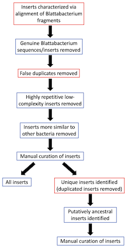

**HGT pipeline**
-------------

Description of the different steps and scripts used to characterise HGT inserts descibed in Ewart et al. The scripts outlined below are in the 'scripts' folder.  

  

Note, alternative thresholds were applied for steps with a red border in the schematic above.
  
***1. Characterising putative Blattabacterium HGT inserts***

Blattabacterium genomes are chopped up and aligned to the Blaberidae cockroach genome.

*Scripts:*  
`1.1.chopping_genome.sh`  
`1.2.extracting-bed.sh`  

***Step 1.1:*** Chop up the Blattabacterium genome in 150 nucleotide chunks to prepare for the alignment. The script is run specifying the input and output name, as well as the length of the 'chunks' you want chopped up:  
`bash 1.1.chopping_genome.sh Blattabacterium-genome.fasta Blattabacterium-genome_chopped.fasta 150`  
*threshold=150*  
*alternate threshold=100*  

After running the script on each genome, combine the various chopped up genomes with 'cat.'

***Step 1.2:*** Align the chopped up Blattabacterium to the reference host genome using bwa mem, implementing default parameters:  
`bwa index reference-genome.fasta`  
`bwa mem reference-genome.fasta Blattabacterium-genome_chopped.fasta > alignment.sam`  

***Step 1.3:*** The alignment is converted into a BED file, representing the putative HGT regions. Overlapping Blattabacterium chunk alignments and near neighbouring alignments are merged into a single putative HGT region. Regions shorter than a specified length are filtered out. The pipeline is run with the following:  
`bash 1.2.extracting-bed.sh`  

The following key parameters need to be set within the bash script:  
- *merging_gap=150* --> this is the acceptable gap (in bp) between neighbouring aligned reads that will be merged into a single putative HGT insert (*alternate threshold = 50 bp*)
- *min_length=50* --> this is the minimum putative HGT insert length (in bp) to retain in the BED file (*alternate threshold = 30 bp*)

  
***2. Filtering HGT inserts***

Filtering and annotating the putative HGT inserts.

*Scripts:*   
`2.1.identifying-contaminants.R`  
`2.2.remove_contaminants.sh`  
`2.3.identifying-duplicates.sh`  
`2.4.filtering-duplicates.sh`  
`2.5.1.batch_sdust.sh`  
`2.5.2.replace_with_Ns.sh`  
`2.5.3.N_content_contiguous.sh`  
`2.6.1.extract-flanks.sh`  
`2.6.2.filtering-flanks.sh`  
`2.7.1.filtering_non-target-bacteria.sh`  
`2.7.2.parse-BLAST_blatta-vs-bacteria.R`  

***Step 2.1:*** Some of the inserts might be contaminant genuine Blattabacterium DNA. These potential contaminants are identified by comparing the length of the insert to the length of the contig which it sits on. If the proportion of the insert length vs contig length exceeds a certain threshold it is possibly a Blattabacterium contig, and hence removed. This pipeline can be run using the following R code:  
`2.1.identifying-contaminants.R` 

Once the putative contaminated contigs have been identified based on the length threshold, the following shell script can be used to quickly remove them and produce a new filtered file:  
`2.2.remove_contaminants.sh`

The resultant filtered bed file will be used in subsequent steps.  

***Step 2.2:*** The most common assembly error is false duplication, hence some duplicate inserts may be artefacts. To identify duplicates, each insert is extracted with some flanking region. It is then BLASTed against all other inserts within the genome, and the top hit is extracted (excluding the hit to itself). This BLAST search can be run for each genomes using the following:  
`bash 2.3.identifying-duplicates.sh`  

The following key parameter needs to be set within the bash script:  
- *flank=300* --> flanking length on either end of putative insert

Very high hits are considered false duplicates, and should be removed from the inserts file so that the number of inserts in the genome is not overestimated. This can be done by running:  
`bash 2.4.filtering-duplicates.sh`  

The following key parameters needs to be set within the bash script:  
- *identity=90* --> removing hits above 90% identity
- *qcov=90* --> removing hits above 90% query coverage

This output of the above will create another bed file. It will also state how many inserts were removed. This filtered bed file will be used in subsequent steps.  

***Important note:*** *There may be groups of false duplicates (i.e. >2 regions that are very close to one another). The pipeline above only considers pairs of false duplicates - if there is a group, it will not remove them all. Hence, this pipeline should be repeated, until 0 inserts are removed; i.e. the output of script '2.4.filtering-duplicates.sh' should be input for '2.3.identifying-duplicates.sh', and the pipeline can then be followed as above. It might take 2-3 iterations to remove all false duplications (depending on the assembly quality). It's important to properly label your bed file after this filtering (you may be left with numerous bed files with growing '_dup-filtered.bed' suffixes.*  

***Step 2.3:*** Some HGT inserts might be the result of a real duplication event, and some might have ‘jumped’ around the genome with a transposon. These are real inserts, but do not represent unique HGT events (i.e. one event occurred, then the insert was duplicated). These real duplications will have relatively high sequence similarity. Hence, to filter the genomes of duplicates, *Step 2.2* should be repeated, but changing the identify/coverage thresholds for script `2.3.identifying-duplicates.sh`:  
- *identity=70* --> removing hits above 70% identity
- *qcov=70* --> removing hits above 70% query coverage

After running the pipeline with the updated identity and query coverage thresholds (and iterating through it a number of times where required) and running `2.4.filtering-duplicates.sh`, a bed file with no duplicates. Hence, while the output of *Step 2.2* will indicate the number of HGT inserts in the genome, the output of *Step 2.3* will indicate the number of 'unique' HGT insert events in the genome.  

***Step 2.4:*** Some of the regions identified as putative HGT inserts may actually be artefacts of BLAST alignment between independently arisen, highly repetitive regions of the bacterial and cockroach genomes. To remove these, the sequences of the putative inserts are extracted from the cockroach genomes, identified using the bed files produced in *Step 2.3*.

Low-entropy regions are then found (and masked) using the sdust algorithm in the minimap package. Any "HGT" contigs with a contiguous masked region >= 50% of the total length are removed.

First, use `2.5.0.extract_inserts.sh` to extract the insert sequences into a FASTA file. Than run `2.5.1.batch_sdust.sh` to mask repetitive regions in a fasta file containing the HGT sequences, `2.5.2.replace_with_Ns.sh` to replace those regions with ambiguous nucleotides (Ns), and `2.5.3.N_content_contiguous.sh` to identify HGTs with contiguous runs of Ns representing >= 50% of their length. Finally, use `2.5.4.remove_low-entropy_inserts.sh` to remove inserts with excessively long low‑entropy regions from the inserts FASTA file.

***Step 2.5:*** For downstream analyses, it is crucial that the flanking cockroach DNA to either side of the inserts can be characterised. To ensure this is the case, HGTs for which either 300-bp flank of cockroach DNA comprises >= 50% Ns (due to ambiguities in sequencing or scaffolding).

Running the script `2.6.1.extract-flanks.sh` will generate fasta files comprising each HGT insert with 300 bp of flanking cockroach sequence that directly precedes and follows it. The script `2.6.2.filtering-flanks.sh` can then be used to retain only the HGTs with flanks that meet the above criterion (ie: < 50% Ns).

***Step 2.6:*** Inserts that were more similar to other bacteria species (i.e. not Blattabacterium) were removed, as they could be potential artefacts, or genuine inserts of other related Bacteriodales. Each insert was BLASTed against two custom databases: one comprising only Blattabacterum sequences database (n = 77), and one with other bacteria, with Blattabacterium sequences removed (n = 2,009,606). If the sequence similarity of the bacteria database BLAST was >2% higher than the Blattabacterium database BLAST, then the sequence was removed. This can be done by first running `2.7.1.filtering_non-target-bacteria.sh`. Note the details for database curation are included in this script.  

This script produces two BLAST files: one for hits against the Blattabacterium database, and one for hits against the bacteria database.  These two outputs are analysed using `2.7.2.parse-BLAST_blatta-vs-bacteria.R` to identify HGT inserts that are subsequently filtered. The following threhsold is used:  
- *thr=2* --> the Blattabacterium hit has to be 'thr'% higher than the bacteria hit

  
***Manual audit:*** *The output of this filtering produced a bed file for each genome. These putative inserts were then manually audited, through additional BLASTs and manual inspections of the sequences themselves.*  

  
***Other analyses***

Several analyses were undertaken on the characterised and filtered HGT inserts (following the pipeline above), including:
- Annotating HGT inserts
- GC content
- HGT insert length distribution
- Insert origins
- Putative age of HGT inserts
- Raw read alignments for additional HGT insert QC

An outline of these analyses and the relevant scripts used can be found [here](https://github.com/MEEP-projects/HGT_pipeline/tree/main/other).

  
**Programs used**   

- ***samtools v1.2:*** https://doi.org/10.1093/gigascience/giab008
- ***bedtools v2.3:*** https://doi.org/10.1093/bioinformatics/btq033
- ***bwa mem v0.7.17:*** https://doi.org/10.1093/bioinformatics/btp324
- ***blastn v2.2.3:*** https://doi.org/10.1186/1471-2105-10-421
- ***minimap2 v2.18:*** https://doi.org/10.1093/bioinformatics/bty191
- ***sdust:*** https://doi.org/10.1089/cmb.2006.13.1028
- ***seqtk v1.4:*** https://github.com/lh3/seqtk.
- ***seqkit 2.9:*** https://doi.org/10.1371/journal.pone.0163962
- ***python v3.11.13:*** https://www.python.org/doc/
- ***python pandas package pandas:*** https://zenodo.org/records/17992932
- ***python biopython package:*** https://doi.org/10.1093/bioinformatics/btp163
- ***R package dplyr v1.1.4:*** https://cran.r-project.org/web/packages/dplyr/index.html
- ***R package data.table v1.17.8:*** https://cran.r-project.org/web/packages/data.table/index.html
- ***R package ggplot2 v3.5.2:*** https://cran.r-project.org/web/packages/ggplot2/index.html
- ***R package tidyverse v2.0:*** https://cran.r-project.org/web/packages/tidyverse/index.html
- ***R package stringr v1.5.1:*** https://cran.r-project.org/web/packages/stringr/index.html

