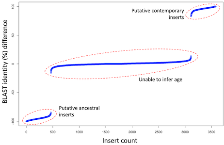

**HGT analyses**
-------------

Description of the analyses and scripts used to analyse the HGT inserts.  

*Scripts:*   
`annotating-bed.sh`  
`gc_content.py`  
`inserts_lengths.R`  
`count_inserts-start-positions.py`  
`plot_inserts-origins.R`  
`extracting-inserts.sh`  
`BLAST-inserts_blatta-vs-host.sh`  
`parse-BLAST_blatta-vs-host.R`  
`inserts_min-age.sh`  
`minimap2_alignment.sh`  
`extract_insert-aligned-reads.sh`  
`alignment_HGT-summary.sh`  

  
***Annotating HGT inserts***  
Annotating the filtered bed file using the genome assembly annotation; i.e. noting whether each putative HGT region sits within and gene, and if so, what part of the gene. This script will output multiple lines if it hits to multiple features (e.g. gene and exon) and if it overlaps features (e.g. it it spans an intergenic region and a gene this will be displayed on multiple lines with the relevant coordinates). This can be run with:  
`bash annotating-bed.sh`  

  
***GC content***  
The following python script calculates the GC content of fasta files (i.e. the genomes or HGT inserts):  
`gc_content.py`  

  
***HGT insert length distribution***  
The following R code calculates plots the length distribution of the annotated inserts, based on the output of 'annotating-bed.sh':  
`inserts_lengths.R`  

  
***HGT insert origins***  
The distribution of the origin of the inserts along the Blattabacterium genome was computed with:  
`count_inserts-start-positions.py`  

This script aligns the inserts the the species specific Blattabacterium strain (e.g. if the insert was characterised in Blatella germanica, it was aligned to the specific Blatella germanica Blattabacterium strain). The insert start position along the Blattabacterium was then recorded. The output of this analysis can be plotted with the following R code:  
`plot_inserts-origins.R`  

  
***Putative age of HGT inserts***  
Inferring whether the filtered putative HGT inserts are ancestral, and inferring a minimum age of the HGT insertion event.  

*Step 1:* The filtered inserts from are extracted from the genomes (as a fasta file), and the species/genome name is added as a prefix to each insert sequence. This can be run using:  
`bash extracting-inserts.sh`  

*Step 2:* Each insert is BLASTed against the particular Blattabacterium strain belong to the species the insert derived (e.g. if the insert is from the Panesthia cribrata genome, the inserts should be BLASTed agains the specific Panesthia cribrata Blattabaactrium symbiont). Only the top hit is kept. Each insert is also BLASTed against all inserts in all other cockroach/termite taxa (excluding itself). Only the top hit is kept. This can be run using:  
`bash BLAST-inserts_blatta-vs-host.sh`  

The following key parameter needs to be set within the bash script:  
- *inserts_dir=inserts* --> the name of the directory that contains extracted inserts (obtained from *Step 3.1*) from all cockroach/termite species (as fasta files)
- *target_inserts=P-crib_Blatta-chunk-alignment_aligned-segments.fasta* --> the name of the insert file (within the *insert_dir* folder) that is being BLASTed.
- *target_blattabacterium=CP142614.1.fasta* --> the Blattabacterium genome specific to the taxa being BLASTed.

This script will output to BLAST files - one for the Blattabacterium blast, and one for the inser database BLAST. 

*Step 3:* The two BLAST output files from *Step 2* are compared to infer the age of the inserts. If the % identity is higher for the Blattabacterium BLAST compared to the cockroach/termite inser BLAST, then it is likely a recent insert. If the % identity is higher for the insert BLAST compared to the Blattabacterium BLAST, then the insert is likely ancestral. If the BLAST results are similar, we do not have confidence to infer the age of the insert. This pipeline can be run using the following R code:  
`parse-BLAST_blatta-vs-host.R`  
   
Clear separations between these three cases were evident in each of the analyses. For example, the image below shows all inserts from *Panesthia tryoni tryoni* (Eungella):

*Step 4:* Of the inserts that were inferred to be ancestral in *Step 3*, the combination of species the insert is found in can be used to infer the minimum age of the insert. For example, if the insert is found in Panesthia cribrata, Geoscapheus dilatatus and Neogeoscapheus hanni, the insert is at least as old as the ancestral node for these three species. First, the ancestral sequences identified in the previous step can be extracted using **seqkt**:  
`seqtk subseq insert-sequences.fasta ancestral_insert-sequence-names.txt > ancestral_insertsequences.fasta`  

These putative ancestral inserts can then be BLASTed against the other inserts, and then data is parsed, using the following:  
`bash inserts_min-age.sh`  

Similar to *Step 3*, the following key parameter needs to be set within the bash script:  
- *inserts_dir=inserts* --> the name of the directory that contains extracted ancestral inserts. These insert fasta files can be obtained by using using a bed file of ancestral inserts, as inferred in *Step 3.3*, and utilising the script in *Step 3.1*.  
- *target_inserts=P-crib_ancestral-inserts.fasta* --> the name of the insert file (within the *insert_dir* folder) that is being BLASTed. This should contain the putative ancestral inserts as inferred in *Step 3.3*.  

The output of this script is a a column of insert IDs for the query species, and a column with all of the species the insert hits to (BLAST hits have to be >70 identity and >70% query coverage). If there are no hits, the second column will contain an 'NA'.

 
***Raw read alignments for addition HGT insert QC***  
When observing the raw sequence read alignments against the putative HGT inserts, some reads span the insert regions and elongate upstream/downstream for hundreds or thousands of nucleotides, while other reads are truncated and aligned to only the insert region, and typically have several nucleotide differences to the reads that elongate upstream/downstream. The former scenario are likely cockroach reads containing the insert region, while the latter scenario are likely Blattabacterium reads (some Blattabacterium are likely included in the sequenced DNA). This pipeline identifies reads for the two scenarios for each insert as additional evidence that there are long reads supporting the former scenario.  

*Step 1:* First raw ONT reads were aligned to the genome using:  
`minimap2_alignment.sh`  

*Step 2:* For each HGT insert, reads that aligned to the region plus some flanking sequence is extracted and saved to a new bam file using:  
`extract_insert-aligned-reads.sh`  

*Step 3:* The following script computes the length distribution of the reads aligned to the HGT insert (i.e. whether they align to only the insert regions or whether theire alignment extends into the flanking region):  
`summary_HGT-alignment.sh`  

*Step 4:* The following script summarises the results of the previous script:  
`count_HGT-alignment.sh`  

